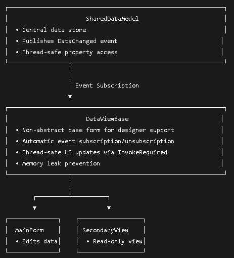

# Desktop application with Real-Time Multi-Form Data Synchronization
> code examples using dotnet and C#

## The Context
You are working on a desktop application that consists of multiple forms. 
Those forms show different views of the same data and they should update in real time. 
Your application is extensible, and third parties can add plug-ins that contain their own views of the data.

## The Problem
 Should you use delegates or events to provide Real-Time Data Synchronization?

 This becomes particularly important when your application is extensible and third-party 
 developers can create plugins with their own custom views of the data.

 ## The Solution: Events
 
 | Aspect    | Delegates | Events |
| -------- | ------- | ------- |
| Encapsulation  | Weaker - subscribers can invoke the delegate   | Stronger - only the declaring class can invoke |
| Safety | Less safe - subscribers can override invocation list     | Safer - controlled add/remove semantics|
| Plugin Support    | Possible but riskier    | Excellent - clear public contract |
| Memory Management    | Manual unsubscribe required    | Built-in unsubscribe pattern |
| Design Guidelines    | Not recommended for cross-class communication   | Standard .NET pattern |

 ## Architecture / Core Components to Implement The Solution
 We are using an event-based pattern for this plugin-based system achieving loose coupling. 
- Your forms don't have to know anything about each other.
- The class that monitors data changes and raises the event doesn't have to know how many forms are listening and how they look.
- Third-party plug-ins can easily subscribe to the events at runtime to be able to respond to changes without tightly coupling to the existing system.
  
.

 ## Extensibility Through Plugins
- Third-party developers can extend the application by implementing a simple plugin interface:

 ```csharp 
public interface IDataViewPlugin
{
    string PluginName { get; }
    Form CreateView(SharedDataModel dataModel);
}
```

## Key Features
### Real-Time Updates
- All forms and plugins receive immediate updates when data changes through the event system.
### Plugin Extensibility
- Third-party developers can create custom views by implementing a simple interface:

 ```csharp 
public class MyCustomPlugin : IDataViewPlugin
{
    public string PluginName => "My Analytics View";
    
    public Form CreateView(SharedDataModel dataModel)
    {
        var form = new Form();
        // Create your custom visualization
        // Subscribe to dataModel.DataChanged event
        return form;
    }
}
```
### Memory Leak Prevention
- The base form automatically handles event unsubscription in OnFormClosed, preventing common memory leaks.

```csharp 
public class DataViewBase : Form
{
    public SharedDataModel DataModel { get; private set; }
    
    protected override void OnFormClosed(FormClosedEventArgs e)
    {
        if (DataModel != null)
        {
            //unsubscribe to prevent memory leaks
            DataModel.DataChanged -= OnDataModelChanged;
        }            
    
        base.OnFormClosed(e);        
    }
}
```
### Thread-Safe UI Updates
- All updates use the InvokeRequired/Invoke pattern to safely update UI from any thread.

```csharp 
public class FormMain : DataViewBase
{
    protected override void UpdateDisplay(string data)
   {
       if (InvokeRequired)
       {
           Invoke(new Action(() => textDataMainForm.Text = data));
       }
       else
       {
           textDataMainForm.Text = data;
       }
   
   }
}
```
### Designer Support
- Forms can be visually designed in Visual Studio while maintaining runtime functionality.

## Running the Example
- [Download .NET](https://dotnet.microsoft.com/en-us/download)
- [Download Visual Studioy](https://visualstudio.microsoft.com/pt-br/downloads/)
- Clone the repository and open the solution in Visual Studio
- Build and run the application
- Observe how changes in the main form update all open views
- Plugins load automatically and respond to data changes

## Conclusion
Events provide the optimal solution for real-time data synchronization across multiple forms in extensible desktop applications. 
They offer superior encapsulation and safety while maintaining excellent performance and memory management characteristics.
